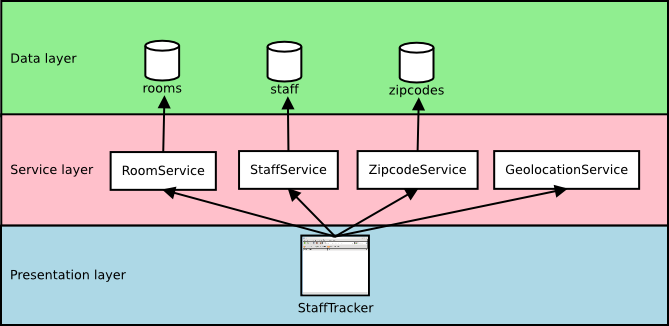

disnix-stafftracker-dotnet-example
==================================
This is an example case representing a system to manage staff of a university
department. The system uses data stored in several databases. For each database,
a web service interface is provided to retrieve and update records. Moreover, a
geo location service is provided using [GeoIP](http://www.maxmind.com/app/ip-location)
to determine the location of a staff member using an IP address. A web
application front-end is provided for end-users to retrieve and edit staff
members.

Architecture
============

The above figure shows the architecture of this example, consisting of three
layers. The data layer contains various SQL server databases storing data sets. The
service layer provides web service interfaces to the databases (the
`GeolocationService` uses GeoIP to lookup location from an IP address). The
presentation layer contains a web application front-end which can be used by end
users to manage staff of a university. All the components in the figure are
*distributable* components (or *services*) which can deployed to various machines
in the network.

Usage
=====
The `deployment/DistributedDeployment` sub folder contains all neccessary Disnix
models, such as a services, infrastructure and distribution models required for
deployment.

Deployment using Disnix in a Windows network
--------------------------------------------
First, you must manually install a network of Windows machines of running the
Disnix service. Then you must adapt the infrastructure model to match to
properties of your network and the distribution model to map the services to the
right machines.

To deploy the databases you must install
[SQL server](http://www.microsoft.com/en-us/server-cloud/products/sql-server/).
To deploy the web services and web application services you must install
[Internet Information Services](http://www.iis.net). Check the instructions of
the corresponding software distributions how to install these system services.
Dysnomia detects the presence of these system services and configures the
corresponding modules to use them.

The system can be deployed by running the following command:

    $ disnix-env -s services.nix -i infrastructure.nix -d distribution.nix

Running the system
==================
After the system has been deployed, open a web browser and type the following URL:

    http://test1/StaffTracker

The `test1` hostname must be replaced by the real hostname of the machine to
which the web application front-end is deployed. Check the distribution model for
this. If the network expression is used included in this example, the third
machine in the network machine automatically boots into IceWM and includes the
Mozilla Firefox web browser for convenience.

License
=======
This package is released under the [MIT license](http://opensource.org/licenses/MIT).
